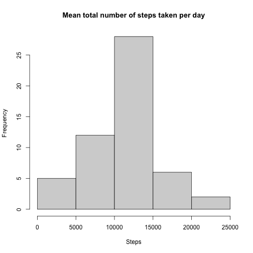
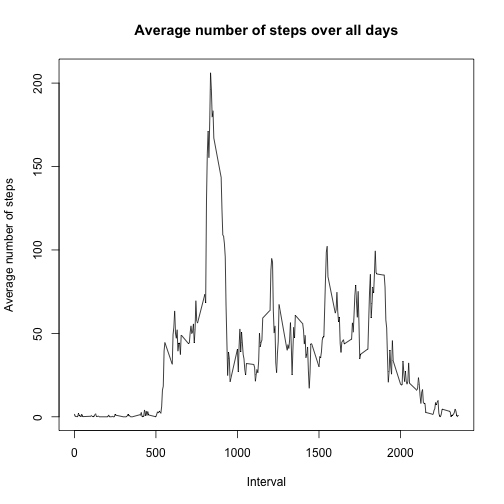
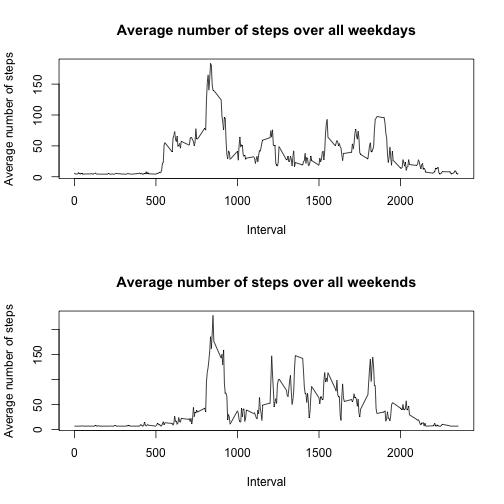

## Load packages


### Setting up global options

```r
knitr::opts_chunk$set(echo = TRUE)
```

# Loading  the data and Preprocessing the data

```r
activity<-read.csv(file = "file:///Users/danielaaguilar/Documents/repo/RepData_PeerAssessment1/activity.csv")

activity<-mutate(activity, steps=as.numeric(steps), date= as.Date(date, "%Y-%m-%d"), interval=as.numeric(interval))

activityclean<-na.omit(activity)
```
## Mean total number of steps taken per day

```r
Stepsperday<- activityclean %>% group_by(date) %>% summarise(TotalSteps=sum(steps))
```
### Histogram 

```r
hist(Stepsperday$TotalSteps, main= "Mean total number of steps taken per day", xlab= "Steps", ylab = "Frequency")
```



### Mean and Median 

```r
Meansteps<-mean(Stepsperday$TotalSteps)
Mediansteps<-median(Stepsperday$TotalSteps)
```

## Daily average activity pattern
### Time series plot (i.e. of the 5-minute interval (x-axis) and the average number of steps taken, averaged across all days (y-axis). 

```r
Actpattern<- aggregate(steps ~ interval, activityclean, mean)
plot(Actpattern$interval, Actpattern$steps, type='l', 
main="Average number of steps over all days", 
xlab="Interval", 
ylab="Average number of steps")
```



### Across all the days  on average the 5-minute interval that contains the maximum number of steps

```r
IntervalMax <- Actpattern[which.max(Actpattern$steps),]
```

## Imputing missing values
### Total number of missing values in the dataset

```r
Totalmissingval<-sum(is.na(activity))
```
### Filling in all of the missing values in the dataset replacing them by the mean of data set and stored in new data set


```r
nas<-as.data.frame(na.aggregate(activity$steps))
activityrep<-cbind(nas,activity)
activityrep<-activityrep[,-2]
names(activityrep)[1]<-"Steps"
```

### Histogram of the total number of steps taken each day

```r
Perdaysteps<- activityrep %>% group_by(date) %>% summarise(Totalsteps=sum(Steps))

hist(Perdaysteps$Totalsteps, main= "Mean total number of steps taken per day", xlab= "Steps", ylab = "Frequency")
```


### Mean and Median when NA's are replaced. The mean remained the same as NA's were replaced by the mean value, the median changed. 

```r
Meansteps1<-mean(Perdaysteps$Totalsteps)
Mediansteps1<-median(Perdaysteps$Totalsteps)
Diffmean= Meansteps - Meansteps1
Diffmedian= Mediansteps - Meansteps1
```

## Activity patterns between weekdays and weekends

### New factor variable in the dataset with two levels – “weekday” and “weekend” indicating whether a given date is a weekday or weekend day.


```r
activitywk<-activityrep %>% mutate(weekday=wday(activityrep$date))

activitywk$weekday<-factor(activitywk$weekday, levels =c(1,2,3,4,5,6,7), labels = c("weekday", "weekday", "weekday", "weekday", "weekday", "weekend", "weekend"))
```
### Plot containing a time series plot of the 5-minute interval and the average number of steps taken, averaged across all weekday days or weekend days.


```r
subwday<- subset(activitywk, weekday == "weekday")
weekdayave<-aggregate(Steps~interval, subwday, mean)
subwend<- subset(activitywk, weekday == "weekend")
weekendave<-aggregate(Steps~interval, subwend, mean)


par(mfrow=c(2,1))
plot(weekdayave$interval, weekdayave$Steps, type='l', 
main="Average number of steps over all weekdays", 
xlab="Interval", 
ylab="Average number of steps")
plot(weekendave$interval, weekendave$Steps, type='l', 
main="Average number of steps over all weekends", 
xlab="Interval", 
ylab="Average number of steps")
```




